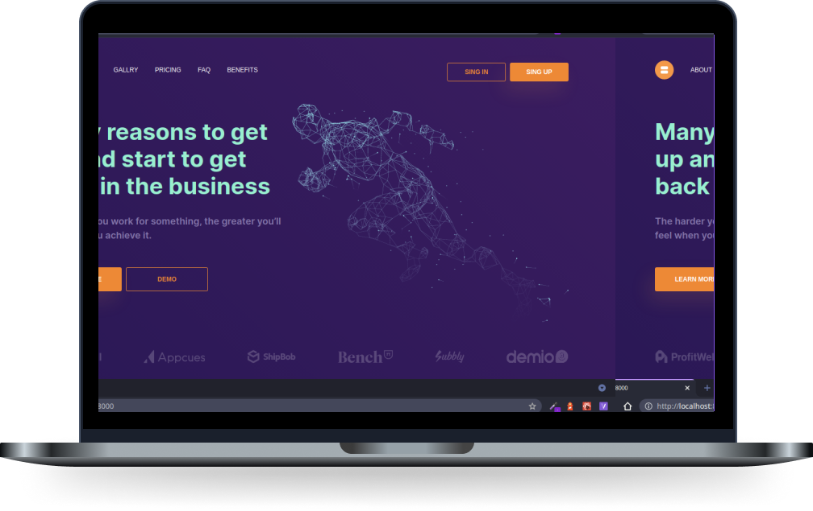

<h1 align="center">
    
   
</h1>

<br>

<p align="center">
  

</p>

## 🧪 Technologies

This project was developed using the following technologies:

- [Next.js](https://nextjs.org/)
- [React](https://reactjs.org)
- [JavaScript](https://developer.mozilla.org/pt-BR/docs/Web/JavaScript)
- [Chakra-Ui](https://chakra-ui.com/)

## 🚀 Getting started

Clone the project and access the folder

```bash
$ git clone https://github.com/FernandaDsilva/lp-figma.git && cd lp-figma
```

Follow the steps below

```bash
# Install the dependencies
$ yarn

# Start the project
$ yarn dev
```

## 💻 Project

[Lp-Figma](https://lp-figma.vercel.app/) The harder you work for something, the greater you’ll feel when you achieve it! 💙 🧡

LpFigma is a study project based on the design of a data processing company. The idea is to apply the knowledge acquired in a real project to exercise the application of react, javascript and responsiveness. The project is develop by [arshakir](https://dribbble.com/arshakir)

## 🔖 Layout

You can view the project layout through the links below:

- [Layout Web](<https://www.figma.com/file/CPOPmgqlaYIGAnI6cVezrT/Landing-Page-Concept-For-Data-Processing-Company-(Copy)>)

Remembering that you need to have a [Figma](http://figma.com/) account to access it.

## 📝 License

This project is licensed under the MIT License. See the [LICENSE](LICENSE.md) file for details.

---

<p align="center">Made with 🖤  by Fernanda Dias</p>
